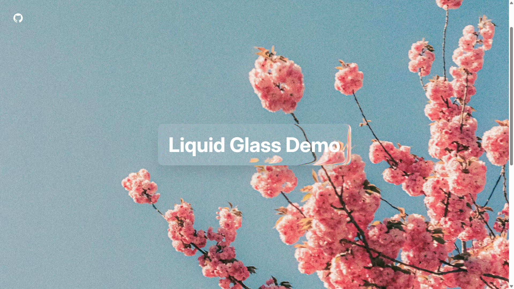

# Liquid Glass (Displacement) Effect

Liquid glass effect made using SVG displacement mapping. This project creates a visual effect that distorts and refracts content behind a glass-like surface, simulating the appearance of liquid or warped glass.



## Tech Stack

- HTML5 & CSS3
- Tailwind CSS v4
- SVG Filters & Effects
- Vite Build Tool

## Getting Started

1. Install dependencies:

   ```bash
   npm install
   ```

2. Start development server:

   ```bash
   npm run dev
   ```

3. Build for production:
   ```bash
   npm run build
   ```
